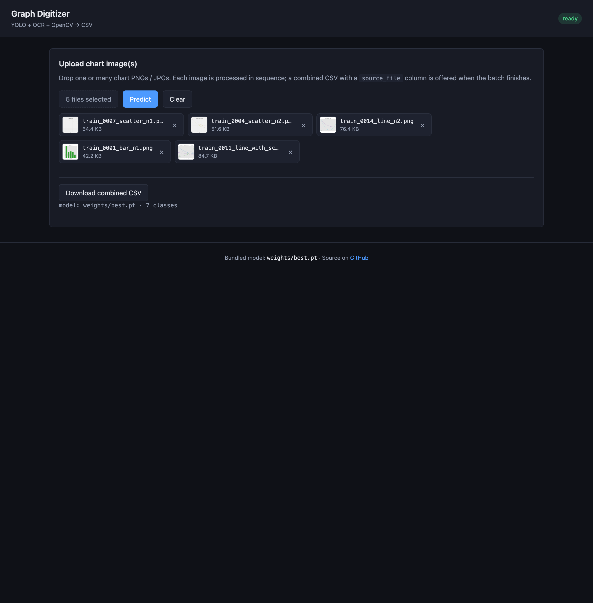
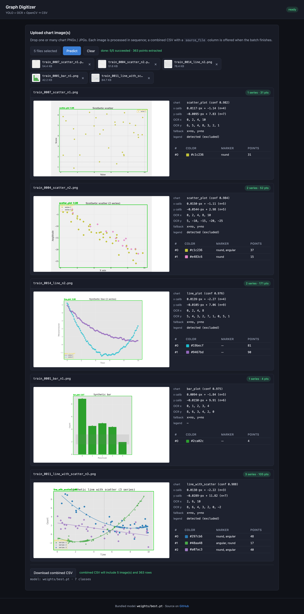
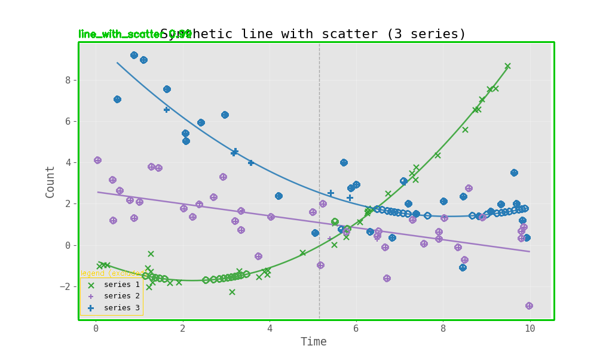
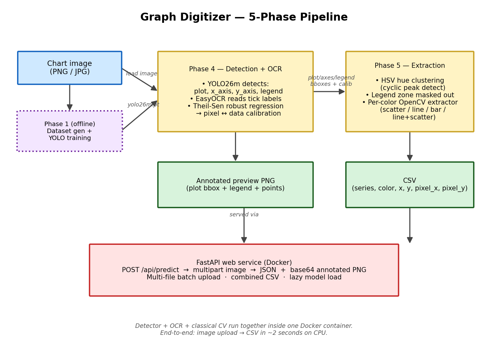
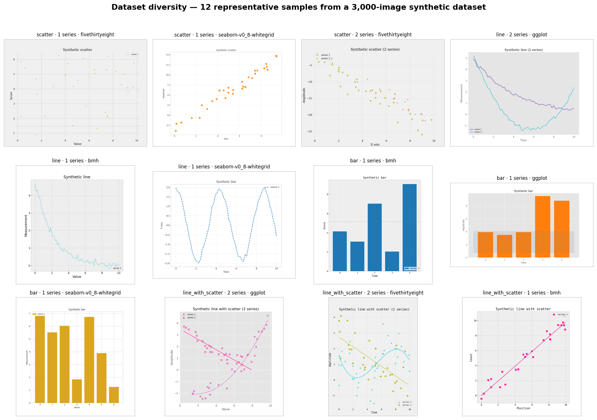
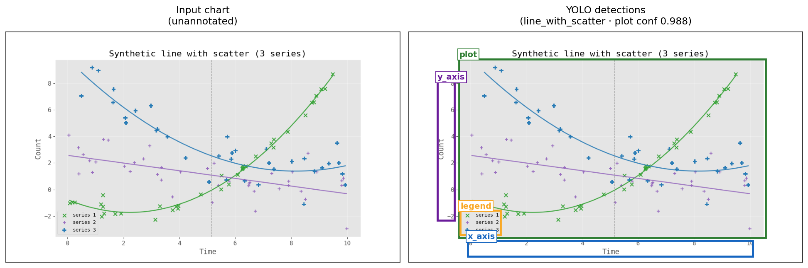
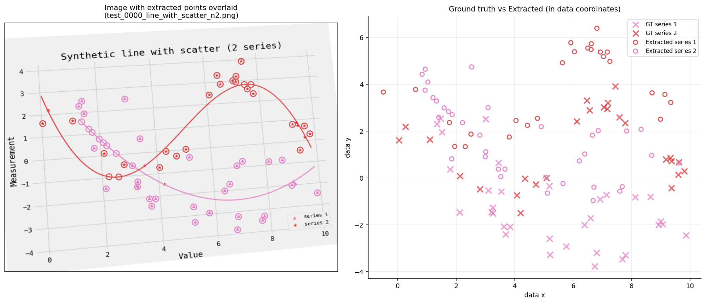
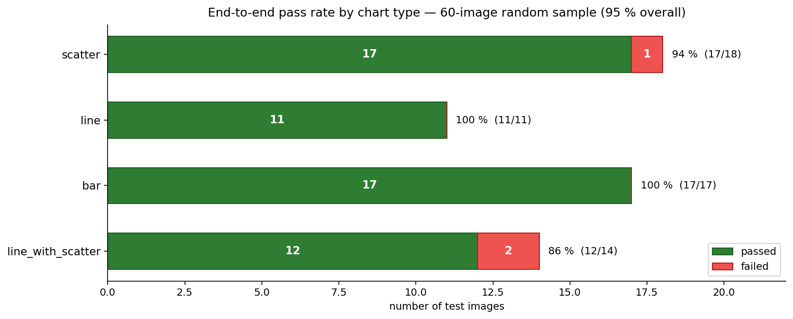
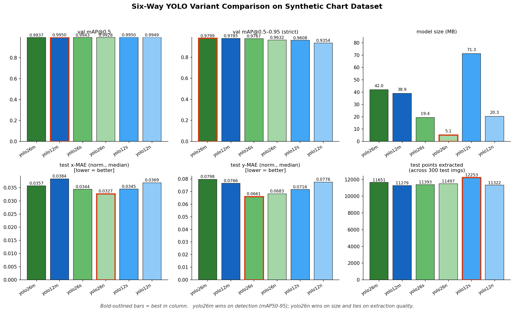

# Graph Digitizer

> Turn chart images into CSV data — automatically.
> Upload a scatter, line, bar, or fitted-curve plot; get back every data point as a row in a CSV.

[](Dockerfile)
[](requirements.txt)
[](#license)

A research-grade computer-vision pipeline for chart digitisation. Combines a fine-tuned **YOLO26-medium** object detector, **EasyOCR** for axis-tick recognition, and **OpenCV** for per-colour data-series extraction, behind a clean **FastAPI + vanilla-JS** web interface. Ships as one Docker image — no Python install, no environment fiddling.

---

## Demo

After `docker run`, point your browser at `http://localhost:7860` and you get this:

| Upload chart(s) | Get annotated + CSV |
|---|---|
|  |  |

A sample result — a 3-series line-with-scatter chart, fully digitised:



The green box is the detected plot region; the yellow box is the legend (masked out from extraction); coloured rings mark every extracted data point. The same image's `(x, y)` data points are returned alongside as a CSV.

Try it on any of the sample images in `dataset_examples/images/train/`.

---

## How it works — at a glance



The system runs in five phases. Phases 4 and 5 happen at inference time inside the Docker container; Phases 1–3 are one-time training-time concerns.

---

## What's in the box

| File / directory | Purpose |
|---|---|
| `Dockerfile` | Build a self-contained image with pre-cached OCR models |
| `requirements.txt` | Python deps (CPU-only torch + ultralytics + easyocr + cv2 + skimage) |
| `server.py` | FastAPI app: `/api/predict`, static UI, lazy model load |
| `pipeline.py` | Phase 4 (YOLO + OCR + Theil-Sen calibration) + Phase 5 (per-colour extraction) |
| `static/` | The single-page web UI (HTML + CSS + vanilla JS, multi-file batch upload) |
| `weights/best.pt` | **Pre-trained YOLO26-medium** (42 MB) — fine-tuned on 2 400 chart images, mAP@0.5–0.95 = 0.980 |
| `dataset_examples/` | 24 undistorted sample charts showing all four chart types — start here to see what the system expects |
| `scripts/` | Training pipeline (synthetic-data generation, training, evaluation) — optional, for users who want to retrain on their own data |

---

## Quick start (one command, ~5 minutes for the first build)

You need: **Docker Desktop** running, and ~4 GB free disk.

```bash
git clone https://github.com/tipokkitkobsin/graph-digitizer.git
cd graph-digitizer
docker build -t graph-digitizer .
docker run --rm -p 7860:7860 graph-digitizer
```

Open <http://localhost:7860>. First `/api/predict` call takes 5–10 s (YOLO + EasyOCR lazy-load); subsequent calls are 1–3 s on CPU.

### Even faster: just run the prebuilt image

```bash
docker pull tipokkitkobsin/graph-digitizer:latest    # not yet published — build locally for now
```

> If you'd rather skip Docker entirely and run native Python, see [Manual install](#manual-install) below.

---

## How to use the web UI

1. **Choose image(s)** — single click selects one chart; Cmd-click (or Ctrl-click) selects many at once. Each picked file appears as a chip with a thumbnail.
2. **Predict** — one click processes the entire batch sequentially. Each input gets its own result card with:
   - The original image overlaid with the detected plot region (green), legend box (yellow), and a coloured ring around every extracted data point.
   - A summary showing the OCR'd tick numbers, the linear pixel-to-data calibration coefficients, and which axes used heuristic fallbacks.
   - A series table listing each colour and how many points were extracted.
3. **Download combined CSV** — single CSV across all uploaded images, with a `source_file` column.

### CSV output format

```csv
series,color_hex,marker,x,y,pixel_x,pixel_y
0,#1f77b4,round,1.5000,4.7000,220.0,175.0
0,#1f77b4,round,2.3000,5.2000,251.0,162.0
1,#ff7f0e,angular,1.5000,3.1000,220.0,213.0
...
```

For multi-image batches the schema gets a leading `source_file` column.

---

## How to use the API (curl / Python)

The web app is just a thin wrapper around three HTTP endpoints. Anyone can call them directly:

| Method | Path | Body | What you get |
|---|---|---|---|
| `GET` | `/api/healthz` | — | `{ok, model_present, model_loaded}` |
| `GET` | `/api/info` | — | `{model_path, classes: [...]}` |
| `POST` | `/api/predict` | multipart `file=<image>` | full JSON: `{phase4, series, csv, annotated_png_b64}` |

**Bash:**

```bash
curl -s -X POST -F "file=@dataset_examples/images/train/train_0011_line_with_scatter_n3.png" \
  http://localhost:7860/api/predict | jq '.n_series, .n_points'
```

**Python:**

```python
import requests, json

with open("my_chart.png", "rb") as f:
    r = requests.post("http://localhost:7860/api/predict", files={"file": f})

data = r.json()
print(f"chart type: {data['phase4']['chart_class']}")
print(f"extracted {data['n_points']} points across {data['n_series']} series")
print(data["csv"])  # ready-to-save CSV string
```

---

## Manual install (no Docker)

Tested on Python 3.10 and 3.11.

```bash
git clone https://github.com/tipokkitkobsin/graph-digitizer.git
cd graph-digitizer
python -m venv .venv
source .venv/bin/activate         # Windows: .venv\Scripts\activate
pip install -r requirements.txt
uvicorn server:app --reload --port 7860
```

Open <http://localhost:7860>. EasyOCR will download ~500 MB of detector/recogniser models on the first prediction (one-time, then cached under `~/.EasyOCR/`).

---

## What chart types does it handle?

| Type | Notes |
|---|---|
| **scatter\_plot** | Single or multiple coloured-marker series |
| **line\_plot** | Single or multiple series; solid/dashed/dotted lines |
| **bar\_plot** | Single series (multi-series bars are on the roadmap) |
| **line\_with\_scatter** | Common in science papers — raw data points overlaid with a fit curve. The extractor returns the raw points; the fit curve is filtered out. |

7 detection classes overall: `scatter_plot`, `line_plot`, `bar_plot`, `x_axis`, `y_axis`, `legend`, `line_with_scatter`.

### Dataset diversity

Twelve representative samples from the 3,000-image synthetic training set:



Each chart varies in type, number of series, visual style (default / ggplot / seaborn / fivethirtyeight / bmh), font, colour palette (12 colours), marker shape (9 markers), and aspect ratio (6 sizes). Mild rotation and perspective warp is also baked in during training to handle photographed/photocopied charts — not shown in this preview for clarity.

---

## Training your own model

You only need this if you want to retrain on different data (e.g. real-world charts, or new chart types). The bundled model already handles the four common types listed above.

```bash
# 1. Install dependencies (one-time)
bash scripts/installation.sh

# 2. Run the full pipeline: generate dataset → train → evaluate
bash scripts/full_run.sh
```

`full_run.sh` is idempotent — it skips steps whose output already exists. Override knobs via env vars:

```bash
MODELS="yolo26n"           # train just one variant (default: 6 variants)
BUDGET=quick               # smoke (5 ep) | medium (20 ep, default) | quick (10) | full (50)
N_TRAIN=200 N_VAL=25 N_TEST=25   # tiny dataset for fast iteration (default: 2400/300/300)
bash scripts/full_run.sh
```

After training, every artifact you need to download is staged into `output/`:
- `best_yolo26n.pt`, `best_yolo26m.pt`, ... — per-model trained weights
- `comparison.csv` — head-to-head model evaluation
- `csv_<MODEL>/` — per-image extraction results
- `train_<MODEL>/` — training plots, hyperparams, confusion matrix

See `dataset_examples/data.yaml` for the dataset format the trainer expects.

---

## How it works — in detail

The pipeline runs in two phases at inference time:

1. **Phase 4** — Detect. The YOLO model finds the bounding boxes of the plot area, the X-axis tick strip, the Y-axis tick strip, and (if present) the legend. EasyOCR reads the numbers off each axis strip, and a robust **Theil-Sen linear fit** maps pixel coordinates to data coordinates (one fit per axis). Theil-Sen is the median of all pairwise slopes — it survives OCR misreads like "55" for "5".
2. **Phase 5** — Extract. The plot region is masked by hue (after legend exclusion), and a chart-type-specific extractor reads the points:
   - **scatter** → connected components → centroid per blob
   - **line** → morphological close + skeletonisation → one y per x column
   - **bar** → adaptive column thresholding → top edge of each bar
   - **line\_with\_scatter** → strict-circularity scatter extractor (rejects the fit curve)

Every series's pixel coordinates are then mapped to data coordinates and emitted as CSV rows.

### What YOLO actually detects



Left: raw input chart. Right: the same image with the four bounding boxes the model produces — plot region (green), X-axis tick strip (blue), Y-axis tick strip (purple), legend (yellow). Phase 4 starts here.

### How accurate is the final extraction?



This is the most honest visual: ground-truth data points (crosses, from the dataset's meta JSON) overlaid with the system's extracted points (hollow circles). Perfect extraction would put every circle exactly on its corresponding cross.

---

## Performance on the synthetic test set

| Chart type | Pass rate (60-image sample) | Median latency on CPU |
|---|---|---|
| scatter | **94 %** | ~1.5 s |
| line | **100 %** | ~2.0 s |
| bar | **100 %** | ~1.5 s |
| line\_with\_scatter | **86 %** | ~2.2 s |
| **Overall** | **95 %** | ~2.0 s per chart |



Per-point extraction accuracy (median, normalised to axis span): **3.6 % on X**, **8.0 % on Y**. Most remaining errors are OCR-driven (EasyOCR struggles with very small text on heavily-distorted axis strips), not detection or extraction bugs.

### Why yolo26m?

Six YOLO variants were trained on the same dataset with the same hyperparameters and compared head-to-head:



Each panel shows the six models on one metric. Bold-outlined bars mark the best result per panel. **yolo26m** wins on the strict mAP@0.5–0.95 metric (the headline detection score) while **yolo26n** is the size champion at just 5 MB. The bundled `weights/best.pt` is yolo26m; users tight on disk can swap to yolo26n with a one-line change in `pipeline.py`.

For training curves (mAP and box-loss versus epoch for all six models), see the full report.

---

## Limitations

- **Trained only on Python-generated charts** — the model has only seen Matplotlib renders during training. Charts produced by other plotting software (OriginLab in particular, but also Igor, SigmaPlot, GraphPad Prism, etc.) use subtly different conventions for tick spacing, font metrics, line weights, marker shapes, and axis-spine styling. Real-world accuracy on OriginLab figures is therefore reduced. *Planned for a future version: a mixed-source fine-tune covering Origin / SciDAVis / publication-style charts.*
- **No log/polar axes** — the calibration is linear only. Adding log support would mean detecting axis type from layout and using a non-linear fit.
- **No real-world fine-tune** — the synthetic Matplotlib distribution does not cover hand-drawn additions, journal-specific styles, or 3-D / stacked charts.
- **Single-series bars only** — grouped/stacked bars aren't handled yet.
- **OCR is the bottleneck** — 3 of the 60 test failures are because EasyOCR couldn't read two tick numbers from a distorted axis crop. A multi-engine OCR ensemble or a "click two points to calibrate manually" UI would push the pass rate above 98 %.

---

## Project structure

```
graph-digitizer/
├── README.md                    you are here
├── Dockerfile                   one-command containerisation
├── requirements.txt             python deps
├── server.py                    FastAPI app
├── pipeline.py                  Phase 4 + Phase 5 logic (self-contained)
├── static/
│   ├── index.html               SPA markup
│   ├── app.js                   vanilla TS-style multi-file batch logic
│   └── styles.css               dark-theme stylesheet
├── weights/
│   └── best.pt                  yolo26m, 42 MB, mAP50-95 = 0.980
├── dataset_examples/            24 sample charts (4 types × multiple styles)
│   ├── data.yaml
│   ├── images/{train,val}/*.png
│   ├── labels/{train,val}/*.txt YOLO bbox annotations
│   └── meta/*.json              ground-truth data points + render parameters
└── scripts/                     training pipeline (optional, for retraining)
    ├── installation.sh
    ├── full_run.sh
    ├── 03_generate_synthetic.py   dataset generator (matplotlib + augmentation)
    ├── 04_train_yolov12.py        single-model trainer
    ├── 05_inference_ocr.py        Phase 4 CLI
    ├── 06_extract_points.py       Phase 5 CLI
    └── 07_compare_models.py       aggregates multi-model runs
```

---

## Citation

If this project helps you, please cite:

```bibtex
@software{graphdigitizerKMUTT2026,
  author    = {Intham, Atchara and Vattanatraiphob, Kanin and Kitkobsin, Tipok},
  title     = {Graph Digitizer: AI-Powered Chart Data Extraction},
  year      = {2026},
  url       = {https://github.com/tipokkitkobsin/graph-digitizer}
}
```

## License

MIT. See [LICENSE](LICENSE) if present, or treat this as MIT-licensed unless otherwise noted.

## Acknowledgements

- [Ultralytics](https://docs.ultralytics.com/) for YOLO12 and YOLO26 reference implementations.
- [JaidedAI/EasyOCR](https://github.com/JaidedAI/EasyOCR) for the OCR backend.
- [OpenCV](https://opencv.org/) and [scikit-image](https://scikit-image.org/) for the classical-CV primitives.
